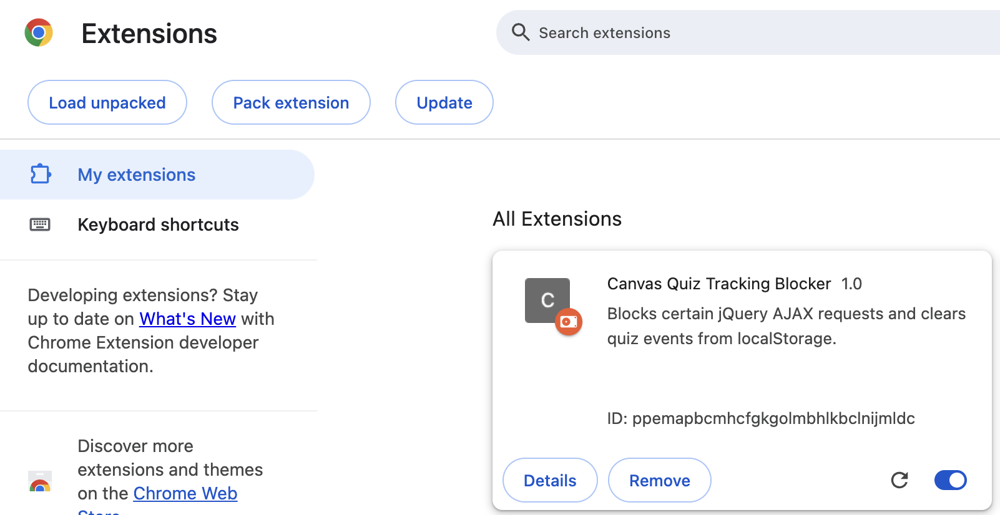
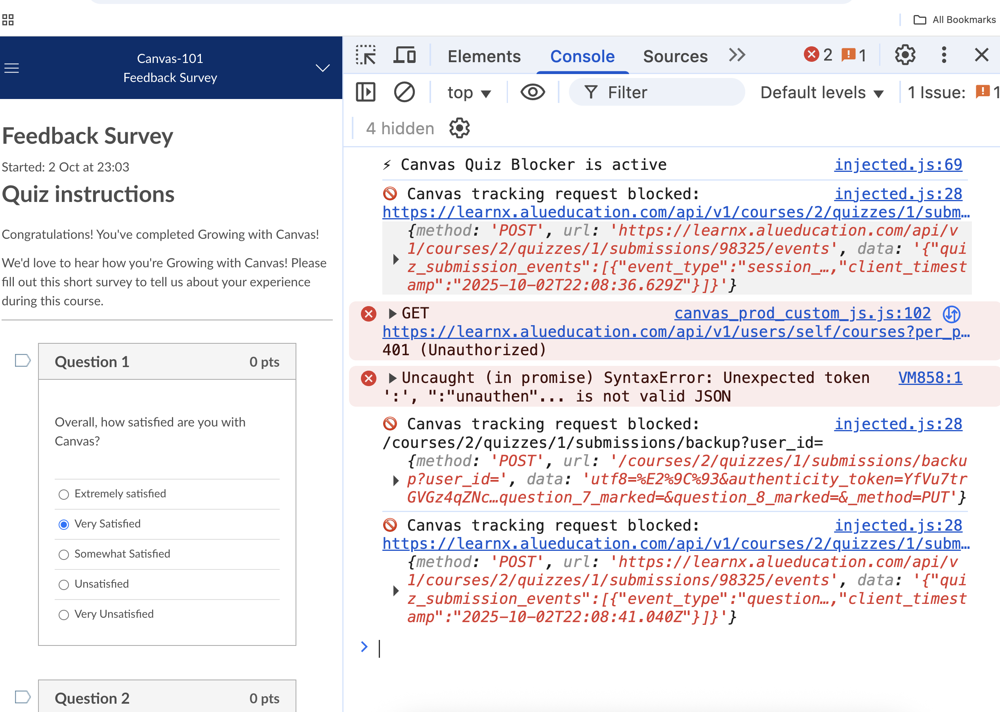
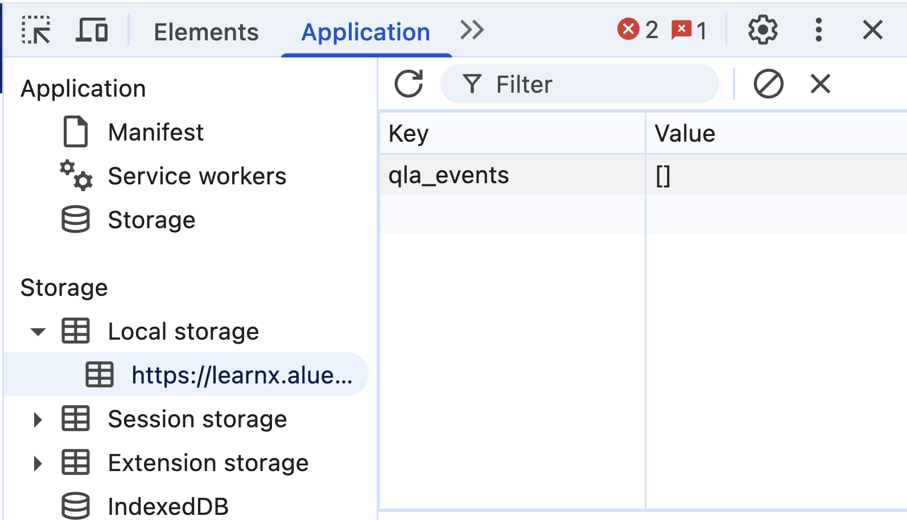

# Canvas Quiz Blocker

A Chrome extension that blocks Canvas from sending quiz event data to the server, preventing Canvas from tracking your quiz progress in real-time.

## Setup

1. Download/Clone this repository.
2. Open Chrome and navigate to `chrome://extensions/`.
3. Enable "Developer mode" using the toggle in the top right corner.
4. Click "Load unpacked" and select the cloned repository folder.
   
5. The extension should now be active.

## Testing

Try with this public canvas quiz link (no login required):
https://learnx.alueducation.com/courses/2/quizzes/1

After starting the quiz, open the console (Mac: Cmd+Option+J, Windows: Ctrl+Shift+J) and you should see messages indicating that quiz-related network requests are being blocked.



Go to the network tab and filter for `/events`. You should see no requests being sent when scroll around the page or select answers.

Finally, go to the application tab, and look for `localStorage`. You should see a key named `qla_events` . This is the "storage" that Canvas uses to store quiz events locally in case of connection issues. Our goal is to gaslight Canvas into thinking that the requests were sent successfully so it can clear the storage. So this should get cleared pretty often by the extension indirectly. We don't directly clear it - we return a successful 204 response so the application thinks the request was successful.



## Allow Quiz Backup

By default, the extension blocks all quiz-related network requests, including backup events. If you want to allow Canvas to "save progress" during a quiz (in case of connection issues), you can modify the `BLOCK_BACKUP` constant in `injected.js`:

```javascript
const BLOCK_BACKUP = false; // Allow quiz backup events
```

# Credits

Thank you to this repo for inspiration.

https://github.com/0xBenCantCode/damn-simple-canvas-exploit

In addition to making a chrome extension, I used native `XMLHttpRequest` to block the requests (so we don't need to wait for jQuery to load). You can pretty much guarentee that no tracking requests will go through with this method!
